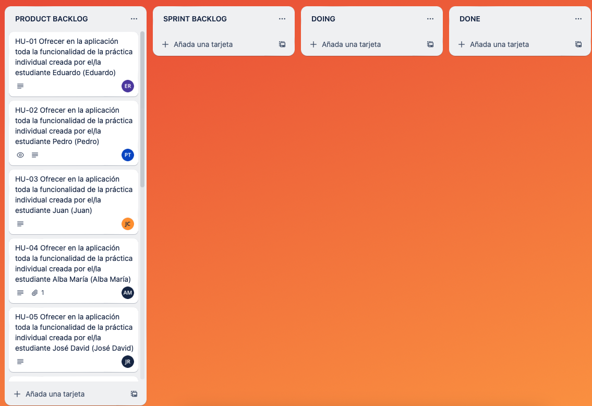
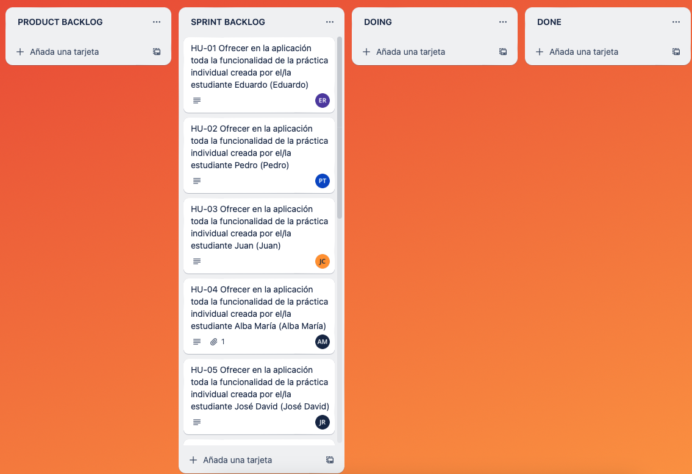

# Práctica 4 - Documentación

## Participantes

* Juan Llavero Company (jlc00052@red.ujaen.es)
* Eduardo Lomas Recena (elr00030@red.ujaen.es)
* Pedro Torrús Castillo (ptc00006@red.ujaen.es)
* Jose David Martínez Romero (jdmr0007@red.ujaen.es)
* Alba María Álvarez Fernández (amaf0001@red.ujaen.es)

## Trello

* URL: https://trello.com/b/F2niGTHm/pr%C3%A1ctica4

* Captura de pantalla **PRODUCT BACKLOG**:

* Captura de pantalla **SPRINT BACKLOG**:

## Descripción del incremento

* Historias de usuario implementadas:

* Capturas de pantalla:

    * Trello ANTES de hacer la HU:
    
    * Trello DESPUÉS de hacer la HU:

* Evidencia de que está hecha la HU: