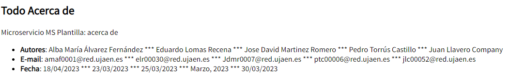
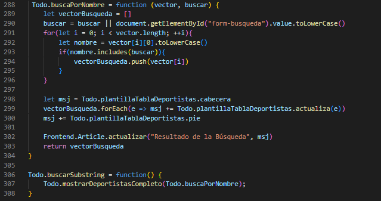

# Práctica 4 - Documentación

## Participantes

* Juan Llavero Company (jlc00052@red.ujaen.es)
* Eduardo Lomas Recena (elr00030@red.ujaen.es)
* Pedro Torrús Castillo (ptc00006@red.ujaen.es)
* Jose David Martínez Romero (jdmr0007@red.ujaen.es)
* Alba María Álvarez Fernández (amaf0001@red.ujaen.es)

## Trello

* URL: https://trello.com/b/F2niGTHm/pr%C3%A1ctica4

### Primer incremento

* Captura de pantalla **PRODUCT BACKLOG**:

* Captura de pantalla **SPRINT BACKLOG**:

### Funcionalidades implementadas
Además de los proyectos individuales (HU-01, ..., HU-05), se han implementado:

**HU-06**:

**HU-07**:

**HU-08**:

**HU-09**:

**HU-10**:

### Sprint Review
En este incremento se ha implementado toda la funcionalidad de los proyectos de los miembros del equipo, además de 
implementar las siguientes historias de usuario adicionales:
- HU-06: ver en una sola página la información de todos los autores de la aplicación al pulsar el botón "Acerca de".
- HU-07: ver un listado solo con los nombres de todos los jugadores de todos los deportes incluidos en la aplicación.
- HU-08: ver un listado solo con los nombres de todos los jugadores de todos los deportes incluidos en la aplicación ordenados.
- HU-09: mostrar el nombre y el deporte de todos los jugadores que contengan una determinada cadena introducida por el usuario.
- HU-10: modificar la visualización de la aplicación con un modo ALTO CONTRASTE.

### Sprint Retrospective
En este incremento se han implementado todas las historias de usuario que se pretendían implementar, aunque eso no significa que no se puedan mejorar. Para futuras iteraciones, además de incluir más funcionalidades, habría que solucionar 
los pequeños problemas visuales que tiene actualmente la aplicación; en este caso son meramente estéticos, pero serían un tema importante a tratar para la próxima iteración.

- Pedro se compromete a introducir CSS a su tabla de deportistas.
- Eduardo se compromete a mejorar la función de ordenar los deportistas.
- Juan se compromete a solucionar la visualización de los botones en la interfaz.
- Alba se compromete a mejorar el apartado "Acerca de" a nivel estético.
- José David se compromete a situar el botón de "Alto Contraste" en un lugar más diferenciativo.

### Final del primer incremento
* Captura de pantalla **DONE**:

